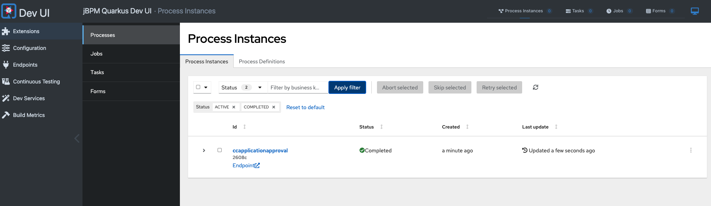

# Credit Card Application Approval Process

This project demonstrates a credit card application approval process using Quarkus and IBM Business Automation Manager Open Edition (BAMOE).

## Prerequisites

Ensure you have the following tools installed:

- Java 17 (developed with semeru-jdk-17.0.11+9)
- Maven CLI (developed with 3.9.8)
- Git CLI
- OC CLI
- Optional: Docker/Podman for faster Maven setup
- Optional: Quarkus CLI for a better experience
- Optional: OpenShift 4 (tested on 4.16.4) for testing OpenShift deployment
- VSCode IDE

To confirm the versions of these tools, you can run:

```sh
java -version
mvn --version
git --version
oc version
docker --version  # or podman --version
quarkus --version
```

## Preparations

1. Install the [Dev Tools VSCode extension](https://marketplace.visualstudio.com/items?itemName=IBM.bamoe-developer-tools).

2. Prepare the OpenShift environment (can be provisioned for free using [Developer Sandbox for Red Hat OpenShift](https://developers.redhat.com/developer-sandbox)).

3. Set up the Maven repository:

### Option 1: Using Podman/Docker

1. Run the Maven repository container:
    ```sh
    podman run -d -p 8585:80 --platform linux/amd64 --name mvn-repo910 quay.io/bamoe/maven-repository:9.1.0-ibm-0001
    ```

2. Add to `~/.m2/settings.xml`:
    ```xml
    <profile>
      <id>ibm-bamoe-910</id>
      <repositories>
        <repository>
          <id>ibm-bamoe-enterprise-maven-repository</id>
          <url>http://localhost:8585</url>
          <releases><enabled>true</enabled></releases>
          <snapshots><enabled>false</enabled></snapshots>
        </repository>
      </repositories>
      <pluginRepositories>
        <pluginRepository>
          <id>ibm-bamoe-enterprise-maven-repository</id>
          <url>http://localhost:8585</url>
          <releases><enabled>true</enabled></releases>
          <snapshots><enabled>false</enabled></snapshots>
        </pluginRepository>
      </pluginRepositories>
    </profile>
    ```

3. Add to the active profiles section:
    ```xml
    <activeProfile>ibm-bamoe-910</activeProfile>
    ```

### Option 2: Local Setup

1. Download `bamoe-9.1.0-maven-repository.zip` from the [IBM Open Editions Developer Access Program](https://ibm.biz/bamoe-developer-program).

2. Unzip:
    ```sh
    unzip bamoe-9.1.0-maven-repository.zip -d ~/.m2/bamoe-910
    ```

3. Configure `~/.m2/settings.xml`:
    ```xml
    <profile>
      <id>ibm-bamoe-enterprise-maven-repository</id>
      <repositories>
        <repository>
          <id>ibm-bamoe-enterprise-maven-repository</id>
          <url>file:///Users/your-username/.m2/bamoe-910/</url>
          <releases><enabled>true</enabled></releases>
          <snapshots><enabled>false</enabled></snapshots>
        </repository>
      </repositories>
      <pluginRepositories>
        <pluginRepository>
          <id>ibm-bamoe-enterprise-maven-repository</id>
          <url>file:///Users/your-username/.m2/bamoe-910/</url>
          <releases><enabled>true</enabled></releases>
          <snapshots><enabled>false</enabled></snapshots>
        </pluginRepository>
      </pluginRepositories>
    </profile>
    ```

4. Activate the profile by adding this in the activeProfiles section:
    ```xml
    <activeProfile>ibm-bamoe-enterprise-maven-repository</activeProfile>
    ```

## Running the Sample

1. Clone the project:
    ```sh
    git clone https://github.com/kmacedovarela/demo-cc-application-approval
    ```

2. Open in VSCode:
    ```sh
    code demo-cc-application-approval
    ```

## Explore the Project

1. Let's start by checking the process and decision files under the resource folders. The process describes the credit card approval process:

   

   This diagram shows the overall flow of the credit card application process, including automatic and manual approval paths.

3.  It includes an automated eligibility decision using DMN (Decision Model and Notation):

    

    This DMN diagram represents the decision logic for determining applicant eligibility. It takes into account factors such as credit score, annual income, and age to calculate an eligibility score.

3.  And for reference, this is how the score is calculated using a decision table: 

    

4. The three main paths are: automatic approval, rejection, and manual approval. These are based on the outcome of the decision nodes.

5. The process includes custom Java code for generating CC details in the `org.acme.cc_approval.service.CreditCardService` class.

## Run in Dev Mode

1. Ensure all dependencies are available:
    ```sh
    mvn clean install
    ```

2. Start Quarkus in dev mode:
    ```sh
    mvn quarkus:dev
    ```
    or with Quarkus CLI:
    ```sh
    quarkus dev
    ```

3. Press `d` to open Quarkus Dev UI in your browser.

4. Locate the "jBPM Quarkus Dev UI" extension and click on "Process Instances" to see the process management console.

5. In the management console, click on the "Process Definition" tab and start a new process instance for "ccapplicationapproval" with the following data:
   - Age: 50
   - Annual income: 50000
   - Credit score: 500
   - Is student: false (unchecked)
   - Name: Karina

   

6. Click on "Go to process details" and check the process information:

   

7. Open the task inbox on the left menu, and click on the user task:

   

   > Note: If no user task is there, it means you took more than 2 minutes (timer event duration). Change the filter to show aborted tasks, and you should see it as `Aborted`.

8. Click on "Claim", open the task again, type "approved" in the approval field, and click "Complete":

   

9. Go back to the process instance details and check what happened:

   
   

### Checking the REST Endpoints

1. Navigate to http://localhost:8080/q/swagger-ui/#/ in your browser.
2. Explore the APIs automatically generated based on the process and decisions.

### Checking GraphQL

In the Dev UI, locate "Kogito Data Index PostgreSQL Quarkus Add-On" to open the GraphQL UI.

Example queries:

List process instances:
```graphql
{
  ProcessInstances {
    id
    processId
    processName
    state
    nodes {
      name
      type
      enter
      exit
    }
  }
}
```

List user tasks with all inputs/outputs:
```graphql
{
  UserTaskInstances {
    name
    priority
    processId
    processInstanceId
    inputs
    outputs
  }
}
```

Query process instances and their variables:
```graphql
{
  ProcessInstances {
    id
    variables
  }
}
```

Get all user task instances for a specific process ID:
```graphql
{
  UserTaskInstances(where: { processId: "your-process-id" }) {
    id
    name
    state
  }
}
```

Query active process instances:
```graphql
{
  ProcessInstances(where: { state: ACTIVE }) {
    id
    processId
    state
  }
}
```

## Packaging and running locally

1. Build and run the application:
    ```sh
    mvn clean package
    java -jar target/quarkus-app/quarkus-run.jar
    ```

## Deploying on OpenShift

1. Log in to OpenShift:
    ```sh
    oc login --token=yourtoken --server=yourserver
    ```

3. Package and deploy on OpenShift:
    ```sh
    mvn clean package -Dquarkus.openshift.deployment=true
    ```

4. To simplify, you can get the Swagger UI URL with:
    ```sh
    echo "http://$(oc get route/cc-application-approval -o jsonpath='{.spec.host}')/q/swagger-ui"
    ```

    

### Deploying the Management Console

1. Get the GraphQL URL:
    ```sh
    echo "http://$(oc get route/cc-application-approval -o jsonpath='{.spec.host}')/graphql"
    ```

2. Deploy the management console:
    ```sh
    oc run mgmt-console --image=quay.io/bamoe/management-console:9.1.0-ibm-0001 --env="RUNTIME_TOOLS_MANAGEMENT_CONSOLE_DATA_INDEX_ENDPOINT=<your-graphql-url>"
    ```

3. Expose the service:
    ```sh
    oc expose pod mgmt-console --port=8080 --name=mgmt-console-service
    oc expose svc/mgmt-console-service
    echo "http://$(oc get route mgmt-console-service -o jsonpath='{.spec.host}')"
    ```

Certainly! I'll rewrite the Testing section of the guide using these commands and explain each step:

## Testing

This section demonstrates how to test the credit card application approval process using curl commands. We'll go through starting a process, claiming a task, updating variables, and querying process details.

```sh
# Query the OpenShift route dynamically and store it in the "url" variable with "http://" prefix
export url="http://$(oc get route cc-application-approval --template='{{ .spec.host }}')"; echo "URL: $url"
```

First, we set the base URL for our API calls to simplify subsequent commands.

```sh
# Start a new process instance and store the process instance ID
export pid=$(curl -X POST "$url/ccapplicationapproval" -H 'accept: application/json' -H 'Content-Type: application/json' -d '{"applicant": {"name": "John", "student": false, "annualIncome": 50000, "creditScore": 500, "age": 50}}' | grep -o '"id":"[^"]*"' | sed 's/"id":"//g' | sed 's/"//g'); echo "Process ID: $pid"
```

This command starts a new process instance with the given applicant data and stores the returned process ID in the `pid` variable.

```sh
# Retrieve the task ID associated with the process instance
export tid=$(curl -X POST "$url/graphql" -H "Content-Type: application/json" -d "{\"query\":\"{ UserTaskInstances(where: { processInstanceId: { equal: \\\"$pid\\\" } }) { id name actualOwner potentialGroups processInstanceId }}\"}" | grep -o '"id":"[^"]*"' | head -n 1 | sed 's/"id":"//g' | sed 's/"//g'); echo "Task ID: $tid"
```

This GraphQL query retrieves the task ID associated with our process instance and stores it in the `tid` variable.

```sh
# Claim the task (without moving the process forward)
curl -X POST "$url/ccapplicationapproval/$pid/reviewApplication/$tid/phases/claim?user=admin" -H 'accept: application/json' -H 'Content-Type: application/json'
```

This command claims the task for the 'admin' user, which is necessary before we can update or complete the task.

```sh
# Update a variable in the task (in this case, reject the application)
curl -X PUT "$url/ccapplicationapproval/$pid/reviewApplication/$tid?user=admin" -H 'accept: application/json' -H 'Content-Type: application/json' -d '{"approval": "rejected"}'
```

Here, we update the task by setting the 'approval' variable to 'rejected'.

```sh
# Retrieve the completed task details (optional)
curl -X POST "$url/graphql" -H "Content-Type: application/json" -d "{\"query\":\"{ UserTaskInstances(where: { processInstanceId: { equal: \\\"$pid\\\" } }) { id name actualOwner potentialGroups processInstanceId }}\"}"
```

This optional step retrieves the details of the completed task using a GraphQL query.

```sh
# Query process instance details (optional)
curl -X POST "$url/graphql" -H "Content-Type: application/json" -d "{\"query\":\"{ ProcessInstances(where: { id: { equal: \\\"$pid\\\" } }) { id processId processName state start end variables } }\"}"
```

